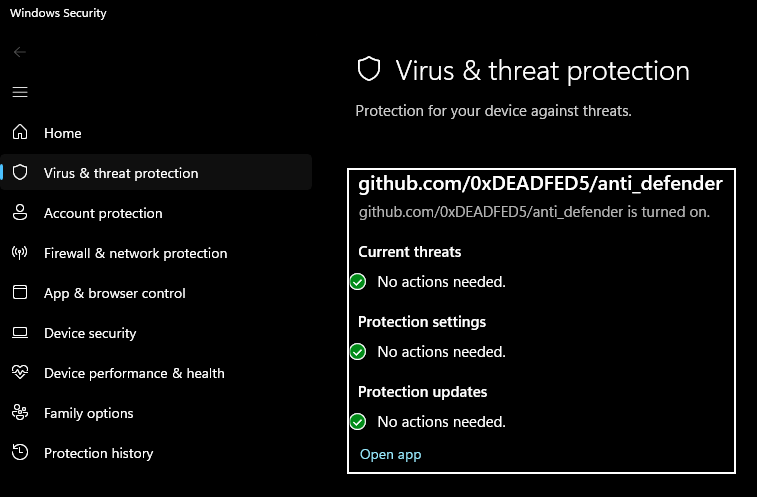

# anti_defender

A slightly more fun way to disable windows defender.



Nearly all the credit goes to https://github.com/es3n1n/no-defender, it is mostly es3n1n's code.

This is an updated version of https://github.com/es3n1n/no-defender.

Changes I (electroglyph) made:

No longer ships with wsc_proxy.exe and wsc.dll, instead I've made a small utility called `wsc_extract` which will grab the necessary files from `avast_free_antivirus_offline_setup.exe`. You must get the Avast offline installer and run wsc_extract.exe *before* you try to use anti_defender_loader. `wsc_extract` by default looks for `avast_free_antivirus_offline_setup.exe`, if that filename changes, just pass the new filename as a parameter to `wsc_extract`.

Hook changes:

In no-defender the hooks are hard-coded. I've updated it so that all the hook addresses are searched for by wildcard pattern inside wsc.dll.  This means that if wsc.dll is updated, but not by too much, this utility should still work.

Startup fix:

The current version of wsc.dll has a little security check at the beginning that terminates itself if it thinks something fishy is going on.  There's a lil 1 byte patch included to bypass that.

## Installation instructions

- Open settings, go to Windows Security, disable real-time protection

- Download the release and extract to a folder

- Download avast_free_antivirus_offline_setup.exe and put it in that folder

- Run wsc_extract.exe to grab the necessary files from inside the installer

- Delete avast_free_antivirus_offline_setup.exe if you want

- Run anti_defender_loader.exe

To uninstall:

- Run `anti_defender_loader.exe --disable`

If Avast's offline installer changes name:

- Run `wsc_extract.exe new_filename_here`

## Compatibility

This has only been tested on Win11 x64.  There are reports of it *not* working on Win10.

## How it works (written by es3n1n)

There's a WSC (Windows Security Center) service in Windows which is used by antiviruses to let Windows know that there's some other antivirus in the hood and it should disable Windows Defender.  
This WSC API is undocumented and furthermore requires people to sign an NDA with Microsoft to get its documentation, so I decided to take an interesting approach for such a thing and used an already existing antivirus called Avast. This AV engine includes a so-called `wsc_proxy.exe` service, which essentially sets up the WSC API for Avast.  
With a little bit of reverse engineering, I turned this service into a service that could add my own stuff there.

## Limitations

Sadly, to keep this WSC stuff even after the reboot, anti_defender adds itself (not really itself but rather Avast's module) to the autorun. Thus, you would need to keep the anti_defender binaries on your disk :(

## Usage
```commandline
Usage: anti_defender_loader [--help] [--version] [--disable] [--name VAR]

Optional arguments:
  -h, --help     shows help message and exits
  -v, --version  prints version information and exits
  --disable      disable the anti_defender stuff
  --name         av name [default: "github.com/es3n1n/anti_defender"]
```

## License
GPL-3.0
